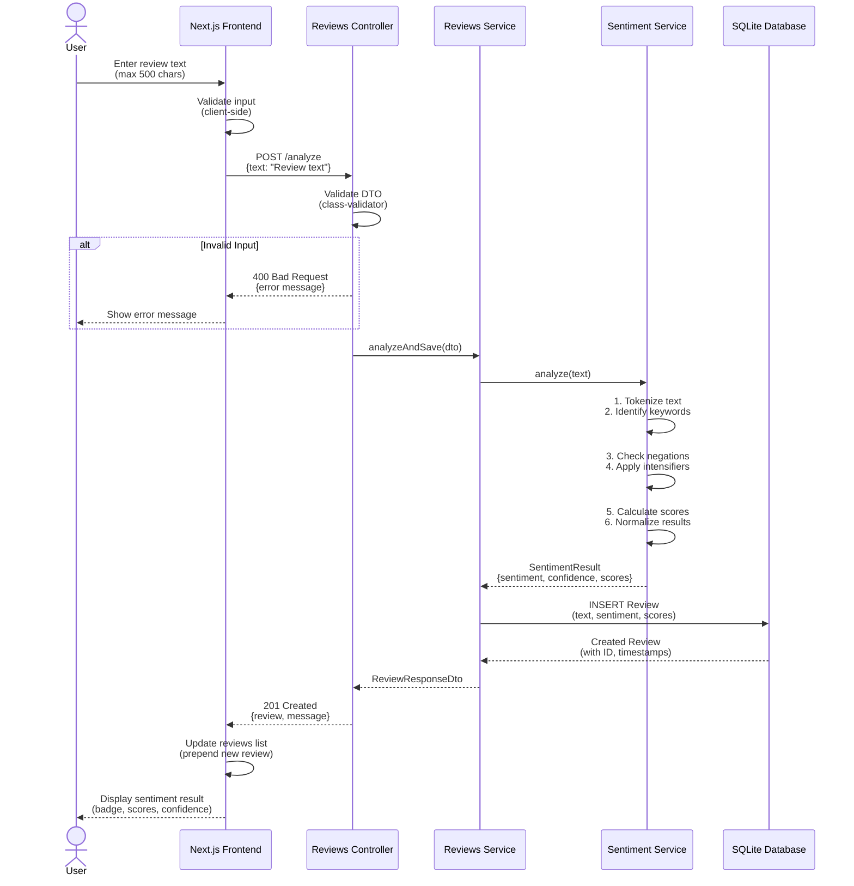

# Analyze Review Flow (Sequence Diagram)

## Flow Steps Explanation

### 1. User Input
- User types review text in textarea
- Character counter shows remaining characters (500 max)
- Submit button enabled when input is valid

### 2. Frontend Validation
- Check text is not empty
- Check text doesn't exceed 500 characters
- Show error message if validation fails

### 3. API Request
- Send POST request to `/analyze` endpoint
- Include review text in request body
- Handle loading state during request

### 4. Backend Validation
- NestJS ValidationPipe validates DTO
- Checks all constraints (@IsString, @MaxLength, etc.)
- Returns 400 error if validation fails

### 5. Sentiment Analysis
- **Tokenization**: Split text into words
- **Keyword Matching**: Compare against positive/negative/neutral dictionaries
- **Negation Handling**: Detect negation words and flip sentiment
- **Intensifier Application**: Apply multipliers for words like "very", "really"
- **Score Calculation**: Weighted sum of keyword matches
- **Normalization**: Ensure scores sum to 1.0

### 6. Database Storage
- Save review with sentiment results
- Auto-generate ID and timestamps
- Store all score details

### 7. Response & Display
- Return review with full sentiment analysis
- Frontend updates UI immediately
- Show sentiment badge with color coding
- Display confidence score and detailed breakdown
