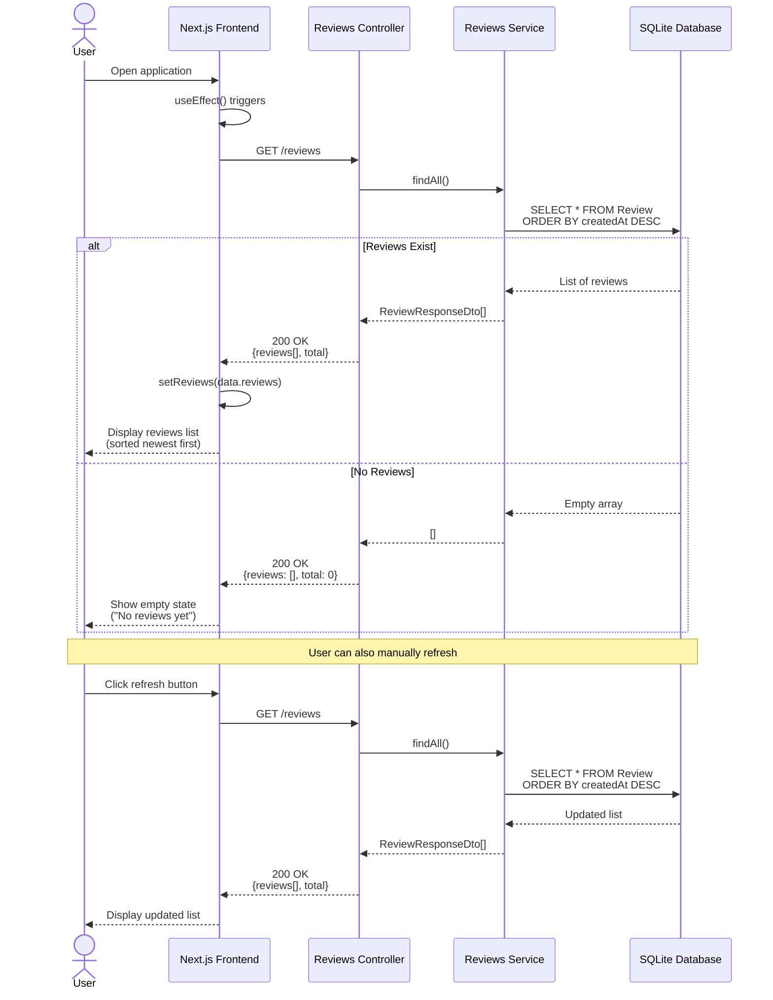

# Get Reviews Flow (Sequence Diagram)

## Flow Steps Explanation

### 1. Initial Load
- Frontend component mounts
- `useEffect` hook triggers on mount
- Automatically fetch all reviews

### 2. API Request
- Send GET request to `/reviews` endpoint
- No parameters required
- Handle loading state

### 3. Database Query
- Fetch all reviews from database
- Order by `createdAt` descending (newest first)
- Include all fields (sentiment scores, confidence, etc.)

### 4. Response Handling
- Backend returns array of reviews with total count
- Frontend updates state with new data
- Reviews displayed in cards with:
  - Sentiment badge (colored by type)
  - Original review text
  - Confidence percentage
  - Score breakdown bars
  - Timestamp

### 5. Empty State
- If no reviews exist, show friendly empty state
- Display message encouraging user to submit first review
- Show icon to indicate no data

### 6. Manual Refresh
- User can click refresh button
- Fetches latest data from database
- Updates UI with any new reviews
