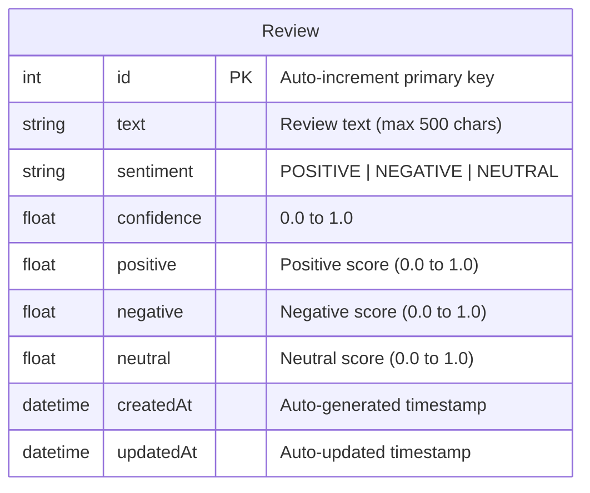

# Database Schema



## Schema Details

### Review Table

| Column | Type | Constraints | Description |
|--------|------|-------------|-------------|
| `id` | INTEGER | PRIMARY KEY, AUTO INCREMENT | Unique identifier |
| `text` | TEXT | NOT NULL | Original review text (validated max 500 chars) |
| `sentiment` | TEXT | NOT NULL | Determined sentiment: POSITIVE, NEGATIVE, or NEUTRAL |
| `confidence` | REAL | NOT NULL | Confidence score of the sentiment (0.0 to 1.0) |
| `positive` | REAL | NOT NULL | Positive sentiment score (0.0 to 1.0) |
| `negative` | REAL | NOT NULL | Negative sentiment score (0.0 to 1.0) |
| `neutral` | REAL | NOT NULL | Neutral sentiment score (0.0 to 1.0) |
| `createdAt` | DATETIME | NOT NULL, DEFAULT NOW | Creation timestamp |
| `updatedAt` | DATETIME | NOT NULL, AUTO UPDATE | Last update timestamp |

### Indexes

- **Primary Key**: `id` (auto-indexed)
- **Sorting**: Queries order by `createdAt DESC` (consider adding index for performance)

### Constraints

- `positive + negative + neutral ≈ 1.0` (enforced by application logic)
- `text.length <= 500` (enforced by API validation)
- `sentiment IN ('POSITIVE', 'NEGATIVE', 'NEUTRAL')` (enforced by TypeScript types)

### Sample Data

```sql
INSERT INTO Review (text, sentiment, confidence, positive, negative, neutral, createdAt, updatedAt)
VALUES (
  'Amazing pizza! Great service and fast delivery.',
  'POSITIVE',
  0.89,
  0.89,
  0.03,
  0.08,
  '2024-01-10 10:30:00',
  '2024-01-10 10:30:00'
);
```

## Prisma Schema

```prisma
model Review {
  id         Int      @id @default(autoincrement())
  text       String
  sentiment  String   // POSITIVE, NEGATIVE, NEUTRAL
  confidence Float
  positive   Float
  negative   Float
  neutral    Float
  createdAt  DateTime @default(now())
  updatedAt  DateTime @updatedAt
}
```
