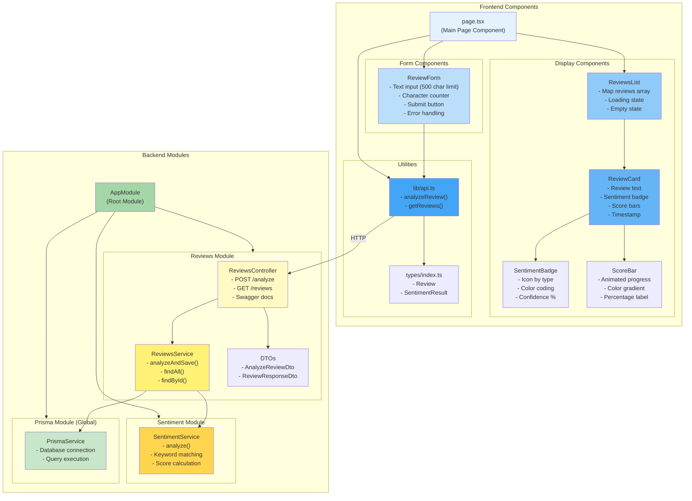

# Component Architecture

## Component Responsibilities

### Frontend Components

#### **page.tsx** (Main Container)
- Manages global state (reviews list)
- Handles data fetching on mount
- Orchestrates child components
- Implements refresh functionality

#### **ReviewForm**
- User input collection
- Client-side validation
- Character counting
- API call to submit review
- Loading and error states

#### **ReviewsList**
- Renders array of reviews
- Loading skeleton/spinner
- Empty state when no reviews
- Passes data to ReviewCard

#### **ReviewCard**
- Displays individual review
- Shows sentiment badge
- Renders score breakdown bars
- Formats timestamp

#### **SentimentBadge**
- Color-coded by sentiment type
- Icon representation
- Confidence percentage display
- Responsive sizing

#### **ScoreBar**
- Animated progress bar
- Color gradients
- Percentage label
- Staggered animation delays

### Backend Modules

#### **AppModule** (Root)
- Imports all feature modules
- Configures global providers
- Sets up middleware

#### **ReviewsModule**
- Feature module for reviews
- Exports ReviewsController and ReviewsService
- Imports SentimentModule

#### **ReviewsController**
- HTTP endpoint handlers
- Request validation
- Swagger documentation
- Response formatting

#### **ReviewsService**
- Business logic
- Coordinates between services
- Database operations via Prisma
- Data transformation

#### **SentimentModule**
- Provides sentiment analysis
- Encapsulates AI logic
- Stateless service

#### **SentimentService**
- Text analysis algorithm
- Keyword matching
- Score calculation
- Confidence determination

#### **PrismaModule** (Global)
- Database connection management
- Provides PrismaService globally
- Lifecycle hooks for connect/disconnect

#### **PrismaService**
- Extends PrismaClient
- Database query execution
- Connection pooling
- Transaction support
